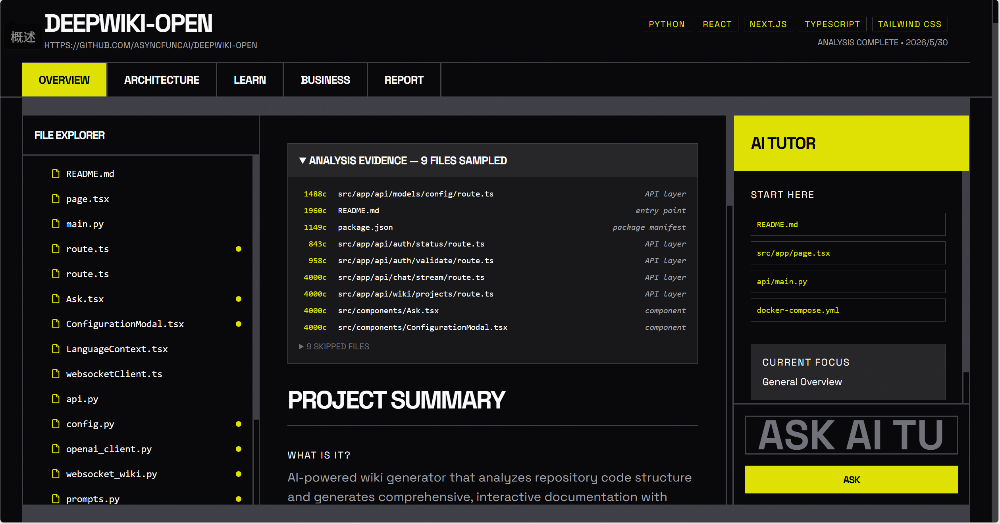
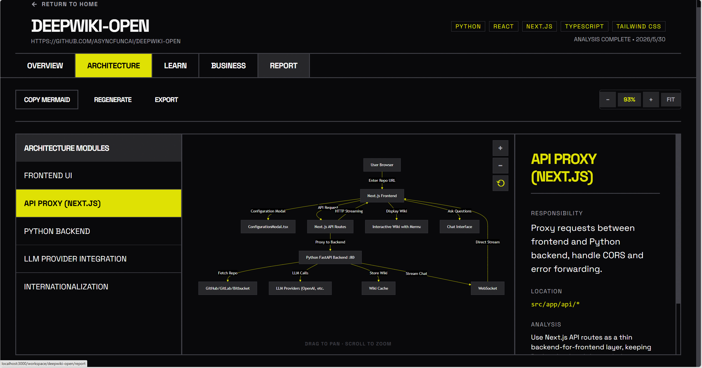
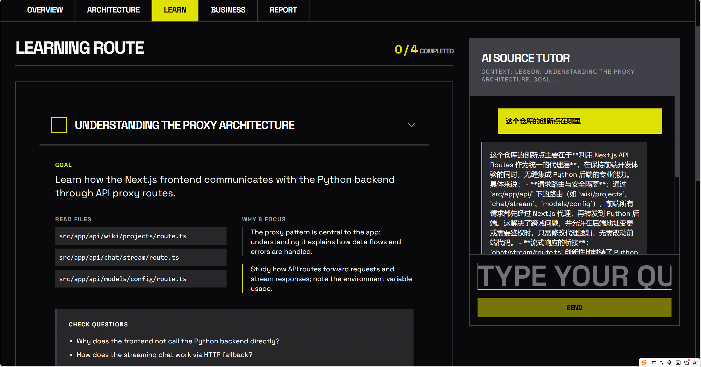
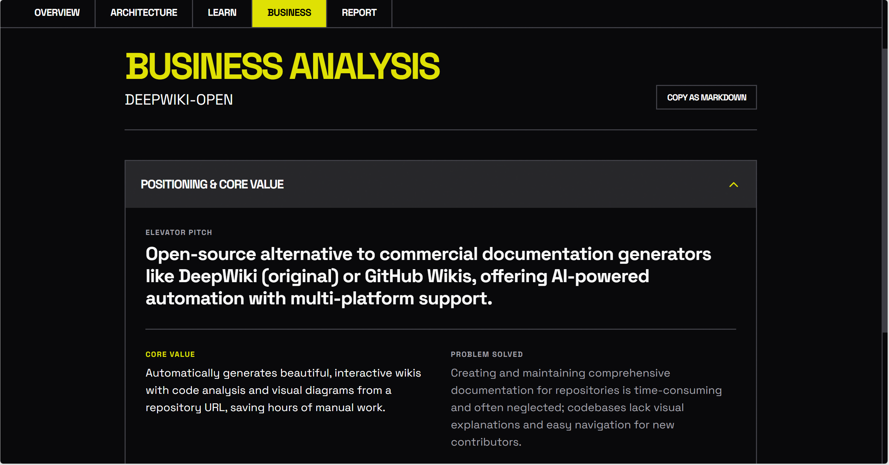
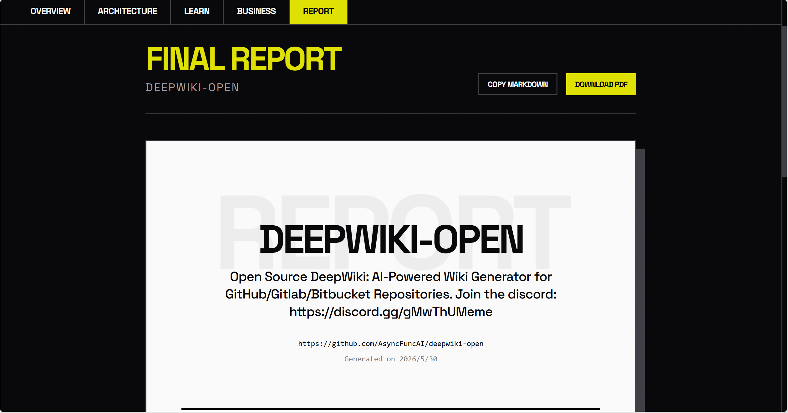
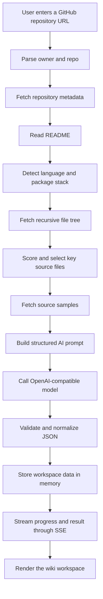

<div align="center">

[中文](./README.md)

<p>
  
</p>

# OpenWiki 🧭

---

### An AI technical wiki platform for understanding GitHub repositories.

OpenWiki turns a public GitHub repository into a browsable, askable, reusable technical workspace: code summaries, file context, architecture diagrams, learning paths, business analysis, and final reports in one flow.

[](https://nodejs.org)
[](https://react.dev)
[](https://www.typescriptlang.org)
[](https://vite.dev)
[](https://tailwindcss.com)
[](https://mermaid.js.org)
[](https://platform.openai.com/docs)
[](#license-)


</div>

<br>

## Overview 🧩

OpenWiki is an AI-powered GitHub repository analysis tool. After a user pastes a repository URL, the system reads repository metadata, README content, tech stack signals, the file tree, and selected source samples, then generates a structured technical wiki.

It is built for developers, technical writers, students, new team members, open-source maintainers, and product evaluators. Instead of relying on the README alone, OpenWiki emphasizes evidence-based understanding: it shows which files were sampled, why they matter, and how they support the generated analysis.

> Tip  
> If you only want to run the project, start with "Quick Start". If you want to understand how repository analysis works, read "How it works" and "Architecture".

<br>

## Why this exists 💡

Understanding an unfamiliar repository is slow. A README explains the entry point, the file tree lacks meaning, architecture has to be reconstructed manually, and product value is rarely visible from code alone.

OpenWiki turns that exploration into a repeatable workflow:

| Common need | What OpenWiki provides |
| --- | --- |
| Know where to start reading | Entry files, core modules, and a recommended reading path |
| See how the system fits together | Mermaid architecture output with an interactive viewer |
| Avoid README-only assumptions | Source sampling with visible analysis evidence |
| Help newcomers learn in order | Step-by-step lessons, questions, and exercises |
| Evaluate product potential | Positioning, users, risks, growth, and competitor analysis |
| Preserve the result | A shareable project report |

<br>

## Key Features ✅

- **Source-aware analysis**: fetches repository metadata, package information, recursive file trees, and important source samples instead of summarizing only the README.
- **Structured technical wiki**: generates project summaries, target users, core functionality, data flow, module explanations, file notes, and learning paths.
- **Interactive architecture diagram**: renders AI-generated Mermaid with pan, zoom, copy, regenerate, and SVG export controls.
- **AI Tutor Q&A**: answers questions using the current file, module, or lesson context.
- **Business analysis layer**: reframes a repository through positioning, pain points, value, competitors, business model, risks, and growth.
- **Final report page**: organizes technical and business analysis into a cleaner shareable format with Markdown copy support.
- **Analysis evidence panel**: lists sampled files, selection reasons, character counts, and skipped files for greater transparency.

<br>

## Demo / Screenshots 📸


The home page focuses on one action: paste a GitHub repository URL and start analysis.


The analysis page uses Server-Sent Events to show live progress while the backend fetches metadata, samples files, and calls the AI model.



The Overview workspace combines project summaries, file trees, sampling evidence, source previews, and the AI Tutor.



The Architecture page renders Mermaid into a draggable, zoomable, exportable diagram canvas.



The Learn page turns a repository into a study path with goals, files, focus areas, questions, and exercises.



The Business page reorganizes open-source project information from a product and market perspective.



The Report page preserves the final analysis for review, sharing, or further editing.

<br>

## How it works ⚙️



The current sampler prioritizes README files, `package.json`, application entry points, routes, services, state stores, pages, components, and configuration files. Generated folders, build output, binary assets, and oversized files are skipped.

| Limit | Current behavior |
| --- | --- |
| Key files | Up to 18 |
| Per-file content | Up to 4,000 characters |
| Total sample budget | About 25,000 characters |
| README snippet | Up to 3,000 characters |
| File tree snippet | First 500 file paths |

<br>

## Quick Start 🚀

### Requirements

- Node.js 20 or newer
- npm
- an API key for DeepSeek or another OpenAI-compatible model provider
- optional but recommended: a GitHub Personal Access Token

### Install

```bash
git clone https://github.com/dakjdakd/openwiki.git
cd openwiki
npm install
```

### Configure

Create a `.env` file in the project root:

```env
OPENAI_API_KEY=sk-your-api-key
OPENAI_BASE_URL=https://api.deepseek.com
GITHUB_TOKEN=github_pat_your-token-here
```

`GITHUB_TOKEN` is optional, but anonymous GitHub API requests have a low rate limit. Configure it if you plan to analyze multiple repositories.

### Run

```bash
npm run dev
```

Open:

```text
http://localhost:3000
```

Enter a public GitHub repository URL, for example:

```text
https://github.com/vercel/next.js
```

<br>

## Usage 🛠️

### Analyze a repository

1. Open the home page.
2. Paste a public GitHub repository URL.
3. Wait for the analysis workflow to complete.
4. Explore Overview, Architecture, Learn, Business, and Report in the workspace.

### Explore the architecture

1. Open the Architecture page.
2. Click `RENDER ARCHITECTURE` to render the existing diagram.
3. Drag to pan and scroll to zoom.
4. Use the toolbar to copy Mermaid, regenerate the diagram, or export SVG.

### Ask the AI Tutor

1. Select a file in Overview, or open a lesson in Learn.
2. The AI Tutor receives the current context automatically.
3. Ask questions such as "Which file should I read first?" or "How does this module connect to the API route?".

### Commands

| Command | Description |
| --- | --- |
| `npm run dev` | Start the Express + Vite dev server on port `3000` |
| `npm run build` | Build the Vite frontend and bundle the server with esbuild |
| `npm run start` | Run the production server from `dist/server.cjs` |
| `npm run lint` | Run TypeScript checks with `tsc --noEmit` |
| `npm run preview` | Start Vite preview |

<br>

## Configuration 🧰

| Variable | Required | Default | Purpose |
| --- | --- | --- | --- |
| `OPENAI_API_KEY` | Yes | None | Calls the OpenAI-compatible model provider |
| `OPENAI_BASE_URL` | No | `https://api.deepseek.com` | Sets the model provider endpoint |
| `GITHUB_TOKEN` | No | None | Raises GitHub API limits and improves reliability |

The current analysis model is configured in `server/services/analyzer.ts`:

```ts
model: "deepseek-v4-flash"
```

The backend uses the OpenAI SDK against an OpenAI-compatible endpoint and requests structured output in JSON mode. Analysis results are currently stored in memory and are cleared when the server restarts.

<br>

## Architecture 🧱

OpenWiki consists of a React frontend, an Express backend, an in-memory project store, a GitHub service, and an AI service. The design stays intentionally small so persistence, OAuth, report export, and custom analysis templates can be added later.

```text
openwiki/
|-- server/
|   |-- index.ts                 # Express app, Vite middleware, route mounting
|   |-- routes/
|   |   |-- analyze.ts            # GET /api/analyze, SSE analysis stream
|   |   `-- project.ts            # project lookup, business regeneration, tutor route
|   |-- services/
|   |   |-- analyzer.ts           # GitHub fetch, file scoring, sampling, AI orchestration
|   |   |-- ai.ts                 # OpenAI-compatible client, JSON mode, retry logic
|   |   `-- github.ts             # GitHub URL parsing and token-injected fetch
|   |-- store/
|   |   `-- projectStore.ts       # in-memory project cache
|   `-- types/
|       `-- index.ts              # shared types
|-- src/
|   |-- App.tsx                   # React Router routes
|   |-- main.tsx                  # React entry
|   |-- pages/
|   |   |-- Home.tsx              # home page and repository input
|   |   |-- analyze/Loading.tsx   # SSE-driven analysis progress page
|   |   `-- workspace/
|   |       |-- Layout.tsx         # workspace shell
|   |       |-- Overview.tsx       # summary, evidence, file tree, tutor
|   |       |-- Architecture.tsx   # Mermaid rendering, pan, zoom, export
|   |       |-- Learn.tsx          # learning path
|   |       |-- Business.tsx       # business analysis
|   |       `-- Report.tsx         # final report
|   |-- components/
|   |-- store/workspaceStore.ts   # Zustand workspace state
|   `-- mock/data.ts              # demo data
|-- public/                       # logo and product screenshots
|-- package.json
|-- tsconfig.json
`-- vite.config.ts
```

### Main stack

| Layer | Technologies |
| --- | --- |
| Frontend | React 19, React Router 7, Tailwind CSS 4, Zustand, Mermaid, Lucide React |
| Backend | Express 4, TypeScript, tsx, esbuild |
| AI | OpenAI SDK, OpenAI-compatible endpoint, JSON mode |
| Data source | GitHub REST API, raw.githubusercontent.com |
| State | Browser Zustand + server-side memory cache |

### API

| Endpoint | Method | Description |
| --- | --- | --- |
| `/api/analyze?url=` | `GET` | Runs full repository analysis through SSE |
| `/api/project/:id` | `GET` | Returns cached project data |
| `/api/project/:id/status` | `GET` | Returns analysis status |
| `/api/project/:id/business` | `POST` | Regenerates business analysis |
| `/api/tutor` | `POST` | Asks the AI Tutor with context |
| `/api/health` | `GET` | Health check |

<br>

## Roadmap 🗺️

Completed:

- GitHub repository metadata, README, file tree, and source sampling
- SSE-based progress during analysis
- AI-generated summaries, modules, lessons, architecture, and business analysis
- Mermaid rendering, copy, regeneration, and SVG export
- Overview file tree, source preview, and analysis evidence panel
- AI Tutor Q&A
- Final report page

Planned:

- PDF export for reports
- Persistent storage for analysis results
- Caching and incremental re-analysis
- Stronger Mermaid validation and repair
- GitHub OAuth and private repository support
- Diff analysis between branches, commits, or pull requests
- Multi-repository comparison
- Docker and deployment guide

<br>

## FAQ ❓

### Why is `OPENAI_API_KEY` required?

OpenWiki's core analysis is generated by an OpenAI-compatible model. Without an API key, the backend cannot complete repository analysis, business regeneration, or Tutor Q&A.

### Can it analyze private repositories?

The current version is designed primarily for public GitHub repositories. Private repositories require OAuth or a more complete token permission flow, which is planned for later work.

### Why configure `GITHUB_TOKEN`?

Anonymous GitHub API requests have a low rate limit and may fail during repeated analysis. A token improves reliability.

### What if the Mermaid diagram fails to render?

AI-generated Mermaid can occasionally be invalid. Try regenerating first, or copy the Mermaid text and inspect it manually. The code already handles some common formatting issues through `sanitizeMermaid()`.

### Why does the analysis feel shallow?

The sampler intentionally limits file count and character budget to control context length and request cost. Adjust `MAX_TOTAL_CHARS`, `MAX_FILE_CHARS`, and the selected file count in `server/services/analyzer.ts` if your model context window allows it.

<br>

## Contributing 🤝

Contributions that improve real repository understanding are welcome. Good starting points include:

- improving file scoring and sampling in `server/services/analyzer.ts`
- strengthening Mermaid cleanup and rendering stability in `src/pages/workspace/Architecture.tsx`
- adding tests for GitHub URL parsing, analysis normalization, and API error handling
- adding persistent storage, report export, and clearer error states
- improving English copy, screenshots, usage examples, and deployment docs

Before submitting changes, run:

```bash
npm run lint
npm run build
```

<br>

## License 📄

`[License]`

This repository does not currently include a root `LICENSE` file. Add one before publishing if reuse terms should be explicit. Some source files include an `Apache-2.0` SPDX marker, but project-level licensing should be defined by the repository license file.

<br>

## Contact 📬

| Item | Details |
| --- | --- |
| Repository | [dakjdakd/openwiki](https://github.com/dakjdakd/openwiki) |
| Maintainer | `[Maintainer]` |
| Docs | `[Docs URL]` |
| Community | `[Community URL]` |

<div align="center">

**OpenWiki turns repository reading from guesswork into evidence-backed exploration.**

</div>
