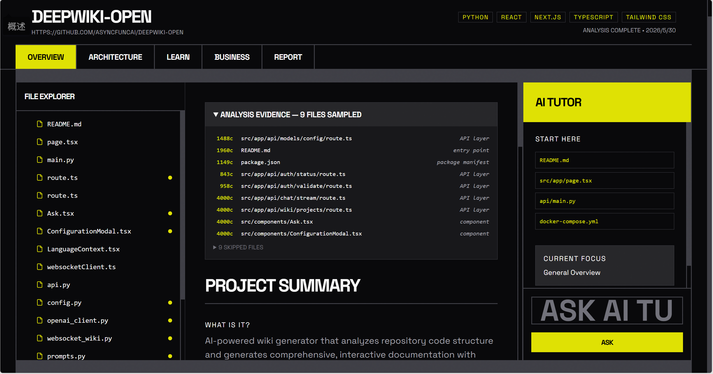
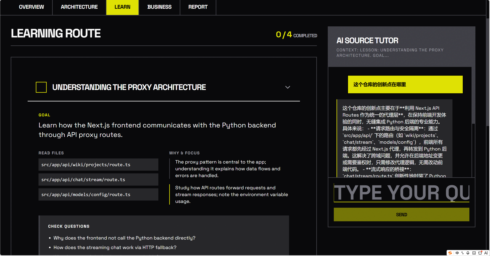
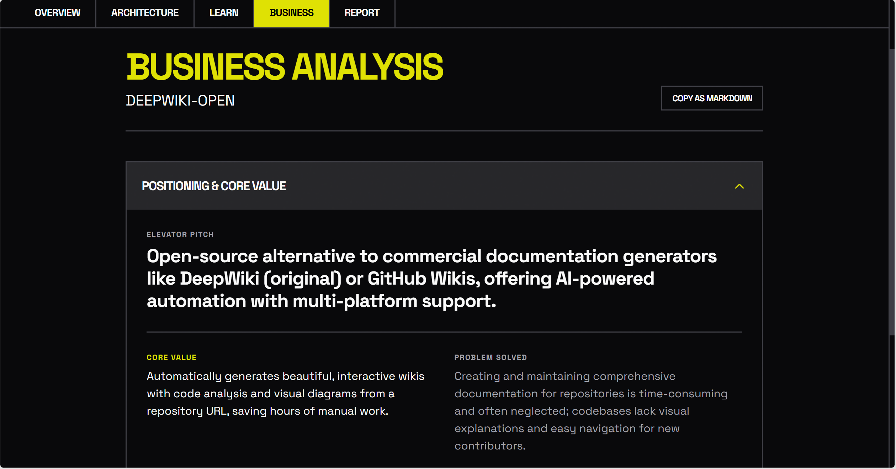
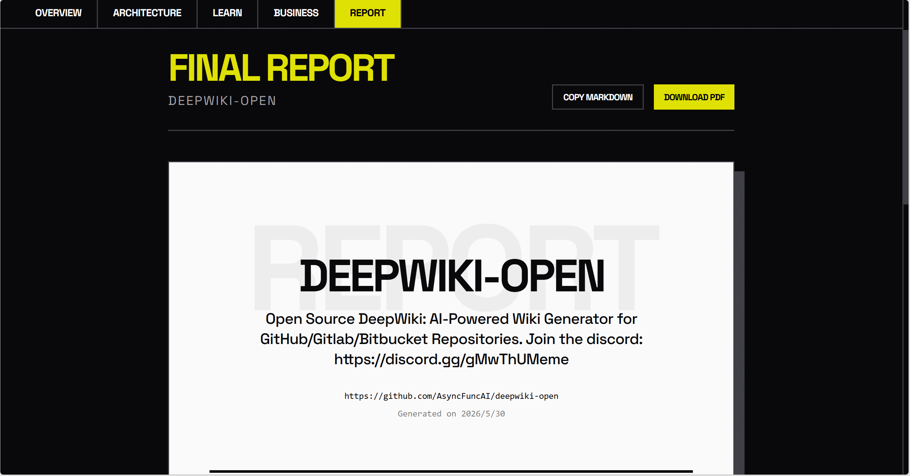
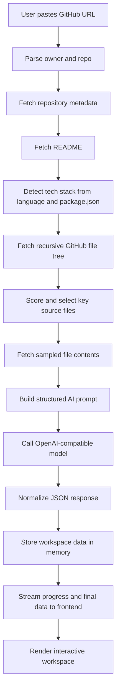
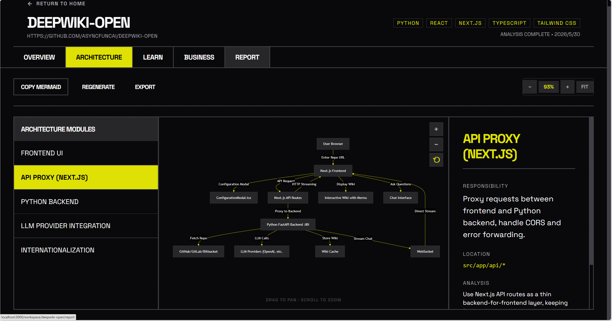

<div align="center">

<p>
  
</p>

# OpenWiki

### Turn any GitHub repository into an AI-generated technical wiki.

[](https://nodejs.org)
[](https://react.dev)
[](https://www.typescriptlang.org)
[](https://vite.dev)
[](https://tailwindcss.com)
[](https://mermaid.js.org)
[](https://platform.openai.com/docs)

**Paste a GitHub URL. OpenWiki reads the repository, samples real source files, and generates a code summary, architecture diagram, learning path, AI tutor context, business analysis, and final report.**

[Features](#features) | [Quick Start](#quick-start) | [How It Works](#how-it-works) | [Architecture](#architecture) | [API](#api) | [Roadmap](#roadmap)

</div>

---

## Preview

The OpenWiki workspace is built around a single flow: paste a repository URL, wait for AI analysis, then explore the generated technical wiki.


## Why OpenWiki

Reading an unfamiliar repository is slow. You open the README, scan the file tree, guess where the real entry point is, jump between routes, stores, services, components, and tests, then try to rebuild the mental model in your head.

OpenWiki turns that first hour of exploration into an interactive workspace:

| What you need | What OpenWiki generates |
| --- | --- |
| Understand the project fast | A concise technical summary, target user, core functionality, entry file, and data flow |
| See how the system is connected | A Mermaid architecture diagram with pan, zoom, copy, regenerate, and SVG export |
| Know which files matter | An AI-explained file explorer and module breakdown |
| Learn the codebase step by step | A lesson-based learning route with goals, files, questions, and exercises |
| Ask follow-up questions | A context-aware AI tutor that uses the file or lesson you are viewing |
| Evaluate the product potential | A business analysis covering users, positioning, competitors, risks, and growth |
| Share the result | A polished final report page with copy-to-Markdown support |

OpenWiki is built for developers, AI engineers, founders, students, technical writers, and anyone who wants to understand a GitHub project without manually mapping every file.

---

## Features

### Source-aware repository analysis

OpenWiki does more than summarize a README. The backend fetches repository metadata, README content, package metadata, a recursive GitHub file tree, and then selects important source files using path-based heuristics.

The current analyzer prioritizes:

- README and package manifests
- application entry points such as `src/main.*`, `src/App.*`, `server/index.*`, `app.*`, and `main.*`
- routes, API layers, services, stores, controllers, handlers, models, and middleware
- pages, components, source files, and framework configuration files
- useful TypeScript, Vite, React, Express, and Tailwind signals

Large generated folders and binary assets are skipped. Sampled files are capped to keep prompts stable:

| Limit | Current behavior |
| --- | --- |
| Maximum selected files | up to 18 key files |
| Maximum per file | 4,000 characters |
| Maximum total sample budget | about 25,000 characters |
| File tree snippet | first 500 files, capped in prompt |
| README snippet | first 3,000 characters |

The generated workspace includes an **Analysis Evidence** panel so users can see which files were sampled and why.

### Interactive architecture workspace

The Architecture page renders AI-generated Mermaid syntax into an interactive diagram.

Core interactions:

- click **Render Architecture** to render the existing analysis
- drag to pan across the diagram
- scroll to zoom
- use toolbar controls for zoom, fit, copy Mermaid, regenerate, and export SVG
- inspect AI-generated modules from the side panel
- regenerate the architecture by re-running `/api/analyze`

The frontend also includes Mermaid sanitation for common AI formatting problems such as malformed `flowchart TD` headers and unsafe labels.

### AI file explorer and module inspector

The Overview page gives users a structured first pass through the repository:

- generated file tree with importance markers
- selected file explanation
- live source preview from `raw.githubusercontent.com`
- project summary, target user, core functionality, and data flow
- core module cards with responsibilities, locations, reasoning, and recommendations

When a file is selected, the active AI tutor context is updated with that file path, explanation, and source preview.



### Guided learning route

The Learn page turns the repository into a curriculum. Each lesson includes:

- a clear goal
- files to read
- why those files matter
- what to focus on
- check questions
- a hands-on exercise
- completion tracking
- automatic movement to the next lesson

This makes OpenWiki useful not only for analysis, but also for onboarding, self-study, code reviews, and technical interviews.



### Context-aware AI tutor

OpenWiki includes a lightweight tutor endpoint:

```http
POST /api/tutor
```

The tutor receives the user's question, active context, and optional chat history. The active context changes as the user browses files, modules, or lessons, so answers are grounded in the part of the codebase the user is currently studying.

### Business intelligence

The Business page treats a repository like a product. It generates:

- positioning and elevator pitch
- target users
- solved problems and pain points
- core value proposition
- competitor landscape
- possible business model
- MVP direction
- growth strategy
- risks
- future opportunities

This is especially helpful when evaluating open-source projects, hackathon ideas, SaaS prototypes, AI tools, and developer platforms.



### Final report

The Report page creates a clean project report containing:

- cover section
- project metadata
- technical overview
- architecture and flow summary
- business analysis
- Markdown copy action

PDF download is currently represented in the UI as a next-phase feature.



---

## Quick Start

### Prerequisites

- Node.js 20 or newer
- npm
- an API key for DeepSeek or another OpenAI-compatible chat completion endpoint
- optional but strongly recommended: a GitHub personal access token

Anonymous GitHub API requests are limited to roughly 60 requests per hour. With `GITHUB_TOKEN`, the limit is much higher and analysis is more reliable for repeated use.

### Installation

```bash
git clone https://github.com/dakjdakd/openwiki.git
cd openwiki
npm install
```

### Environment variables

Create a `.env` file in the project root:

```env
OPENAI_API_KEY=sk-your-api-key
OPENAI_BASE_URL=https://api.deepseek.com
GITHUB_TOKEN=github_pat_your-token-here
```

`GITHUB_TOKEN` is optional, but recommended.

### Development server

```bash
npm run dev
```

Open:

```text
http://localhost:3000
```

Paste a public GitHub repository URL, for example:

```text
https://github.com/vercel/next.js
```

Then start the analysis.

---

## Commands

| Command | Description |
| --- | --- |
| `npm run dev` | Start the Express + Vite development server on port `3000` |
| `npm run build` | Build the Vite frontend and bundle the server with esbuild |
| `npm run start` | Run the production server from `dist/server.cjs` |
| `npm run lint` | Run TypeScript type checking with `tsc --noEmit` |
| `npm run preview` | Start Vite preview |

---

## How It Works



The analysis endpoint uses Server-Sent Events, so the loading page can display live progress while the backend moves through each step:

| Step | Meaning |
| --- | --- |
| `0` | Fetching repository metadata |
| `1` | Parsing README |
| `2` | Detecting tech stack |
| `3` | Fetching file tree |
| `4` | Sampling key source files |
| `5` | Running AI analysis |
| `6` | Validating response |
| `7` | Finalizing data |

---

## Architecture

OpenWiki is intentionally small and easy to modify. The app has a React frontend, an Express backend, an in-memory project store, and a thin AI service wrapper.

```text
openwiki/
|-- server/
|   |-- index.ts                 # Express app, Vite middleware, route mounting
|   |-- routes/
|   |   |-- analyze.ts            # GET /api/analyze SSE analysis stream
|   |   `-- project.ts            # project lookup, business regeneration, tutor route
|   |-- services/
|   |   |-- analyzer.ts           # GitHub fetch, file scoring, sampling, AI orchestration
|   |   |-- ai.ts                 # OpenAI-compatible client, JSON mode, retry logic
|   |   `-- github.ts             # GitHub URL parsing and token-injected fetch
|   |-- store/
|   |   `-- projectStore.ts       # in-memory project cache
|   `-- types/
|       `-- index.ts              # shared data and API types
|-- src/
|   |-- App.tsx                  # React Router routes
|   |-- main.tsx                 # React entry
|   |-- pages/
|   |   |-- Home.tsx              # repository input and landing experience
|   |   |-- analyze/Loading.tsx   # SSE-driven loading screen
|   |   `-- workspace/
|   |       |-- Layout.tsx         # workspace shell and navigation
|   |       |-- Overview.tsx       # summary, evidence, file explorer, tutor
|   |       |-- Architecture.tsx   # Mermaid rendering, pan, zoom, export
|   |       |-- Learn.tsx          # lesson roadmap and tutor
|   |       |-- Business.tsx       # business intelligence sections
|   |       `-- Report.tsx         # final report page
|   |-- components/
|   |   |-- home/                 # home page sections
|   |   |-- layout/               # navbar and footer
|   |   `-- ui/                   # Button, Card, Input primitives
|   |-- store/
|   |   `-- workspaceStore.ts     # Zustand single source of truth
|   `-- mock/
|       `-- data.ts               # demo workspace data
|-- package.json
|-- tsconfig.json
`-- vite.config.ts
```

### Frontend

- React 19
- React Router 7
- Zustand for workspace state
- Tailwind CSS 4
- Mermaid 11 for diagrams
- Lucide React for icons
- Motion and react-fast-marquee for UI motion



### Backend

- Express 4
- TypeScript
- `tsx` for development
- GitHub REST API
- OpenAI SDK configured for an OpenAI-compatible endpoint
- JSON mode through `response_format: { type: "json_object" }`
- retry handling for rate limits and temporary API failures

---

## API

### `GET /api/analyze`

Runs a complete repository analysis and streams progress through SSE.

Query:

| Name | Required | Description |
| --- | --- | --- |
| `url` | yes | Public GitHub repository URL |

Example:

```http
GET /api/analyze?url=https%3A%2F%2Fgithub.com%2Fvercel%2Fnext.js
```

SSE events return either progress:

```json
{
  "step": 4,
  "message": "Sampling key source files..."
}
```

or final workspace data:

```json
{
  "step": 7,
  "data": {
    "project": {},
    "summary": {},
    "fileTree": [],
    "modules": [],
    "lessons": [],
    "architecture": "flowchart TD\\n...",
    "business": {},
    "analysisEvidence": {}
  }
}
```

### `GET /api/project/:id`

Returns cached workspace data for an analyzed repository.

### `GET /api/project/:id/status`

Returns the current status and step for an analyzed repository.

### `POST /api/project/:id/business`

Regenerates the business analysis section for a cached project.

### `POST /api/tutor`

Asks the AI tutor a context-aware question.

Body:

```json
{
  "question": "Where should I start reading this repository?",
  "context": "Viewing File: src/App.tsx...",
  "history": []
}
```

Response:

```json
{
  "answer": "Start with the router and then follow..."
}
```

---

## Data Model

The AI returns a structured workspace object:

```ts
interface WorkspaceData {
  project: Project;
  summary: Summary;
  fileTree: TreeNode[];
  modules: Module[];
  lessons: Lesson[];
  architecture: string;
  business: Business;
  analysisEvidence: AnalysisEvidence;
}
```

Important generated sections:

| Field | Purpose |
| --- | --- |
| `summary` | human-readable project summary, users, entry point, data flow, start-here list |
| `fileTree` | AI-explained repository files and importance |
| `modules` | architectural modules with responsibility and recommendations |
| `lessons` | learning route for understanding the project |
| `architecture` | raw Mermaid syntax |
| `business` | product and market analysis |
| `analysisEvidence` | sampled files and skipped files used during analysis |

---

## Configuration Notes

### Model provider

By default, the project is configured for DeepSeek:

```env
OPENAI_BASE_URL=https://api.deepseek.com
```

Because the backend uses the OpenAI SDK, you can point `OPENAI_BASE_URL` to another OpenAI-compatible provider as long as the selected model supports chat completions and JSON responses.

The current analysis model is set in code as:

```ts
model: "deepseek-v4-flash"
```

### GitHub access

OpenWiki fetches public repository data through GitHub APIs. For repeated analysis, add:

```env
GITHUB_TOKEN=github_pat_your-token-here
```

This token is injected into GitHub requests by the backend service.

### Storage

Project analysis data is currently stored in memory. Restarting the server clears analyzed projects. This keeps the MVP simple and easy to inspect.

---

## Use Cases

- Quickly understand an unfamiliar open-source repository
- Generate onboarding material for a team
- Explore architecture before contributing to a project
- Create a learning roadmap for students or junior developers
- Evaluate whether a repository has product or startup potential
- Prepare for code review, technical interviews, or implementation planning
- Turn GitHub repositories into readable technical notes

---

## Roadmap

Completed:

- source-aware repository analysis
- key source file sampling
- live SSE progress during analysis
- AI-generated summaries, modules, lessons, architecture, and business analysis
- interactive Mermaid architecture rendering
- pan, zoom, copy, regenerate, and SVG export for diagrams
- context-aware tutor route
- final report page
- analysis evidence panel

Planned:

- real PDF export for final reports
- persistent storage for analyzed projects
- cached and incremental re-analysis
- richer Mermaid validation and repair
- private repository support through GitHub OAuth
- diff analysis between two commits or branches
- multi-repository comparison
- plugin-style custom analysis templates
- deployment guide and Docker support

---

## Contributing

OpenWiki is a compact project, which makes it a good place to experiment with AI-assisted code understanding.

Good areas to improve:

- file scoring and source sampling in `server/services/analyzer.ts`
- Mermaid cleanup and diagram rendering in `src/pages/workspace/Architecture.tsx`
- tutor memory and conversation history
- report export and Markdown generation
- persistent project storage
- better error states for GitHub and AI provider failures
- tests for analyzer normalization and GitHub URL parsing

Recommended workflow:

```bash
npm install
npm run lint
npm run build
```

---

## Troubleshooting

### `OPENAI_API_KEY is missing`

Create `.env` in the project root and add:

```env
OPENAI_API_KEY=sk-your-api-key
```

Then restart the dev server.

### GitHub rate limit errors

Add a GitHub token:

```env
GITHUB_TOKEN=github_pat_your-token-here
```

Then restart the dev server.

### Mermaid diagram fails to render

The AI may occasionally return invalid Mermaid syntax. Try:

- clicking **Regenerate**
- copying the Mermaid text and checking the syntax
- improving `sanitizeMermaid()` in `src/pages/workspace/Architecture.tsx`

### Analysis feels too shallow

The current sampler intentionally limits source size to control token usage. Increase `MAX_TOTAL_CHARS`, `MAX_FILE_CHARS`, or the selected file count in `server/services/analyzer.ts` if your model context window and budget allow it.

---

## License

No license file is currently included in this repository. Add a `LICENSE` file before publishing if you want to make the reuse terms explicit.

---

<div align="center">

**OpenWiki helps you read real code, not just READMEs.**

If this project helps you understand a repository faster, consider starring it on GitHub.

</div>
