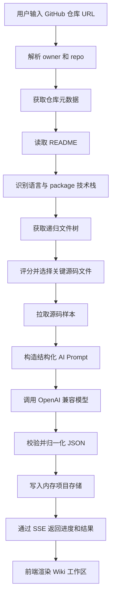

<div align="center">

[English](./README.en.md)

<p>
  
</p>

# OpenWiki 🧭

---

### 面向 GitHub 仓库理解的 AI 技术 Wiki 平台。

OpenWiki 将一个公开 GitHub 仓库转化为可浏览、可追问、可复用的技术工作区：从代码摘要、文件脉络、架构图，到学习路线、业务分析和最终报告，帮助开发者更快建立项目全貌。

[](https://nodejs.org)
[](https://react.dev)
[](https://www.typescriptlang.org)
[](https://vite.dev)
[](https://tailwindcss.com)
[](https://mermaid.js.org)
[](https://platform.openai.com/docs)
[](#许可证-)


</div>

<br>

## 项目概览 🧩

OpenWiki 是一个 AI 驱动的 GitHub 仓库分析工具。用户粘贴仓库地址后，系统会读取仓库元数据、README、技术栈、文件树和关键源码样本，并生成结构化的技术 Wiki。

它适合开发者、技术写作者、学生、团队新人、开源项目维护者和产品评估者。相比只读 README 或手动翻目录，OpenWiki 更强调“带证据的理解”：它会展示哪些文件被采样、为什么重要，以及这些文件如何支撑最终分析。

> Tip  
> 如果你只想最快跑起来，请直接查看“快速开始”。如果你想理解系统如何分析仓库，请从“工作原理”和“技术架构”开始。

<br>

## 为什么做这个 💡

理解一个陌生仓库通常很慢：README 只讲入口，文件树缺少语义，架构关系需要自己拼接，业务价值也很难从代码中直接看出来。

OpenWiki 试图把这段探索过程压缩成一个稳定流程：

| 常见问题 | OpenWiki 的处理方式 |
| --- | --- |
| 不知道项目从哪里读起 | 生成入口文件、核心模块和推荐阅读路径 |
| 看不清系统如何连接 | 输出 Mermaid 架构图，并提供交互式查看 |
| README 和真实代码不完全一致 | 采样关键源码，把采样证据展示给用户 |
| 新人学习缺少节奏 | 生成分步骤课程、问题和练习 |
| 需要判断项目价值 | 生成定位、用户、风险、增长和竞品分析 |
| 想沉淀结果 | 生成可复制的项目报告 |

<br>

## 核心功能 ✅

- **源码感知分析**：不只总结 README，还会获取仓库元数据、package 信息、递归文件树，并用启发式规则采样关键源码。
- **结构化技术 Wiki**：生成项目摘要、目标用户、核心功能、数据流、模块说明、文件解释和学习路线。
- **交互式架构图**：AI 输出 Mermaid，前端提供渲染、拖拽、缩放、复制、重新生成和 SVG 导出。
- **AI Tutor 问答**：根据当前查看的文件、模块或课程上下文回答问题，适合边读边问。
- **业务分析视角**：从产品定位、用户痛点、核心价值、竞品、商业模式、风险和增长方向审视仓库。
- **最终报告页**：将技术与业务分析整理成更适合分享的报告，并支持复制为 Markdown。
- **分析证据面板**：展示采样文件、采样原因、字符数和跳过文件，让分析过程更透明。

<br>

## 效果展示 📸


首页聚焦一个动作：输入 GitHub 仓库地址并开始分析。


分析页通过 Server-Sent Events 展示实时进度，让用户知道系统正在获取元数据、采样文件或调用 AI。


Overview 工作区集中展示项目摘要、文件树、采样证据、源码预览和 AI Tutor。


Architecture 页面将 Mermaid 图渲染为可拖拽、可缩放、可导出的架构画布。


Learn 页面将仓库转成学习路线，包含目标、阅读文件、关注点、问题和练习。


Business 页面从产品和市场角度重新组织开源项目的信息。


Report 页面沉淀最终分析结果，适合复盘、分享或继续编辑。

<br>

## 工作原理 ⚙️


```mermaid
flowchart TD
    A[用户输入 GitHub 仓库 URL] --> B[解析 owner 和 repo]
    B --> C[获取仓库元数据]
    C --> D[读取 README]
    D --> E[识别语言与 package 技术栈]
    E --> F[获取递归文件树]
    F --> G[评分并选择关键源码文件]
    G --> H[拉取源码样本]
    H --> I[构造结构化 AI Prompt]
    I --> J[调用 OpenAI 兼容模型]
    J --> K[校验并归一化 JSON]
    K --> L[写入内存项目存储]
    L --> M[通过 SSE 返回进度和结果]
    M --> N[前端渲染 Wiki 工作区]
```

当前采样策略优先选择 README、`package.json`、应用入口、路由、服务层、状态管理、页面、组件和配置文件。生成目录、构建产物、二进制资源和过大的文件会被跳过。

| 限制项 | 当前行为 |
| --- | --- |
| 关键文件数量 | 最多 18 个 |
| 单文件内容 | 最多 4,000 字符 |
| 总采样预算 | 约 25,000 字符 |
| README 片段 | 最多 3,000 字符 |
| 文件树片段 | 前 500 个文件路径 |

<br>

## 快速开始 🚀

### 环境要求

- Node.js 20 或更高版本
- npm
- DeepSeek 或其他 OpenAI 兼容模型服务的 API Key
- 可选但推荐：GitHub Personal Access Token

### 安装

```bash
git clone https://github.com/dakjdakd/openwiki.git
cd openwiki
npm install
```

### 配置

在项目根目录创建 `.env`：

```env
OPENAI_API_KEY=sk-your-api-key
OPENAI_BASE_URL=https://api.deepseek.com
GITHUB_TOKEN=github_pat_your-token-here
```

`GITHUB_TOKEN` 不是必填项，但匿名 GitHub API 有较低频率限制；如果需要连续分析多个仓库，建议配置。

### 启动

```bash
npm run dev
```

打开：

```text
http://localhost:3000
```

输入一个公开 GitHub 仓库地址，例如：

```text
https://github.com/vercel/next.js
```

<br>

## 使用方式 🛠️

### 分析一个仓库

1. 打开首页。
2. 粘贴公开 GitHub 仓库 URL。
3. 等待分析流程完成。
4. 进入工作区查看 Overview、Architecture、Learn、Business 和 Report。

### 查看架构图

1. 打开工作区的 Architecture 页面。
2. 点击 `RENDER ARCHITECTURE` 渲染已有图。
3. 拖拽画布平移，滚轮缩放。
4. 使用工具栏复制 Mermaid、重新生成或导出 SVG。

### 向 AI Tutor 提问

1. 在 Overview 中选择一个文件，或在 Learn 中查看一节课程。
2. 右侧 AI Tutor 会自动获得当前上下文。
3. 输入问题，例如“我应该先读哪个文件？”或“这个模块和 API 路由是什么关系？”。

### 常用命令

| 命令 | 说明 |
| --- | --- |
| `npm run dev` | 启动 Express + Vite 开发服务器，默认端口 `3000` |
| `npm run build` | 构建 Vite 前端，并用 esbuild 打包服务端 |
| `npm run start` | 从 `dist/server.cjs` 启动生产服务 |
| `npm run lint` | 使用 `tsc --noEmit` 执行 TypeScript 检查 |
| `npm run preview` | 启动 Vite preview |

<br>

## 配置说明 🧰

| 配置项 | 必填 | 默认值 | 作用 |
| --- | --- | --- | --- |
| `OPENAI_API_KEY` | 是 | 无 | 调用 OpenAI 兼容模型服务 |
| `OPENAI_BASE_URL` | 否 | `https://api.deepseek.com` | 指定模型服务地址 |
| `GITHUB_TOKEN` | 否 | 无 | 提高 GitHub API 额度，降低请求失败概率 |

当前分析模型在 `server/services/analyzer.ts` 中配置为：

```ts
model: "deepseek-v4-flash"
```

后端通过 OpenAI SDK 访问兼容接口，并在 JSON 模式下请求结构化结果。项目分析结果目前保存在内存中，服务重启后会清空。

<br>

## 技术架构 🧱

OpenWiki 由 React 前端、Express 后端、内存项目存储、GitHub 服务和 AI 服务组成。整体设计偏轻量，便于继续扩展持久化、OAuth、报告导出和更多分析模板。

```text
openwiki/
|-- server/
|   |-- index.ts                 # Express 应用、Vite 中间件、路由挂载
|   |-- routes/
|   |   |-- analyze.ts            # GET /api/analyze，SSE 分析流
|   |   `-- project.ts            # 项目读取、业务分析再生成、Tutor 路由
|   |-- services/
|   |   |-- analyzer.ts           # GitHub 获取、文件评分、采样、AI 编排
|   |   |-- ai.ts                 # OpenAI 兼容客户端、JSON 模式、重试逻辑
|   |   `-- github.ts             # GitHub URL 解析与 token 注入 fetch
|   |-- store/
|   |   `-- projectStore.ts       # 内存项目缓存
|   `-- types/
|       `-- index.ts              # 共享类型
|-- src/
|   |-- App.tsx                   # React Router 路由
|   |-- main.tsx                  # React 入口
|   |-- pages/
|   |   |-- Home.tsx              # 首页与仓库输入
|   |   |-- analyze/Loading.tsx   # SSE 驱动的分析进度页
|   |   `-- workspace/
|   |       |-- Layout.tsx         # 工作区外壳
|   |       |-- Overview.tsx       # 摘要、证据、文件树、Tutor
|   |       |-- Architecture.tsx   # Mermaid 渲染、平移、缩放、导出
|   |       |-- Learn.tsx          # 学习路线
|   |       |-- Business.tsx       # 业务分析
|   |       `-- Report.tsx         # 最终报告
|   |-- components/
|   |-- store/workspaceStore.ts   # Zustand 工作区状态
|   `-- mock/data.ts              # Demo 数据
|-- public/                       # Logo 与产品截图
|-- package.json
|-- tsconfig.json
`-- vite.config.ts
```

### 主要技术栈

| 层级 | 技术 |
| --- | --- |
| 前端 | React 19、React Router 7、Tailwind CSS 4、Zustand、Mermaid、Lucide React |
| 后端 | Express 4、TypeScript、tsx、esbuild |
| AI | OpenAI SDK、OpenAI 兼容接口、JSON mode |
| 数据来源 | GitHub REST API、raw.githubusercontent.com |
| 状态存储 | 浏览器 Zustand + 服务端内存缓存 |

### API

| 接口 | 方法 | 说明 |
| --- | --- | --- |
| `/api/analyze?url=` | `GET` | 通过 SSE 运行完整仓库分析 |
| `/api/project/:id` | `GET` | 获取已缓存项目数据 |
| `/api/project/:id/status` | `GET` | 获取分析状态 |
| `/api/project/:id/business` | `POST` | 重新生成业务分析 |
| `/api/tutor` | `POST` | 基于上下文向 AI Tutor 提问 |
| `/api/health` | `GET` | 服务健康检查 |

<br>

## 路线图 🗺️

已完成：

- GitHub 仓库元数据、README、文件树和关键源码采样
- 基于 SSE 的分析进度流
- AI 生成摘要、模块、课程、架构图和业务分析
- Mermaid 架构图渲染、复制、重新生成和 SVG 导出
- Overview 文件树、源码预览和分析证据面板
- AI Tutor 问答
- 最终报告页

计划中：

- 报告 PDF 导出
- 分析结果持久化存储
- 缓存与增量重新分析
- 更强的 Mermaid 校验和修复
- GitHub OAuth 与私有仓库支持
- 分支、提交或 PR 之间的差异分析
- 多仓库对比
- Docker 与部署指南

<br>

## 常见问题 ❓

### 为什么需要 `OPENAI_API_KEY`？

OpenWiki 的核心分析由 OpenAI 兼容模型生成。没有 API Key 时，后端无法完成仓库分析、业务分析再生成和 Tutor 问答。

### 可以分析私有仓库吗？

当前主要面向公开 GitHub 仓库。私有仓库需要 OAuth 或更完整的 token 权限流程，属于后续路线图。

### 为什么建议配置 `GITHUB_TOKEN`？

匿名 GitHub API 请求额度较低，连续分析多个仓库时容易触发限制。配置 token 可以显著提高稳定性。

### Mermaid 图渲染失败怎么办？

AI 可能偶尔生成不合法的 Mermaid。可以先点击重新生成，也可以复制 Mermaid 文本手动检查；代码中的 `sanitizeMermaid()` 已处理部分常见格式问题。

### 分析结果为什么不够深？

当前采样策略为了控制上下文长度和请求成本，会限制文件数量和字符数。可以在 `server/services/analyzer.ts` 中调整 `MAX_TOTAL_CHARS`、`MAX_FILE_CHARS` 和采样数量。

<br>

## 贡献指南 🤝

欢迎围绕真实使用体验改进 OpenWiki。比较适合入手的方向包括：

- 改进 `server/services/analyzer.ts` 中的文件评分和采样策略
- 增强 `src/pages/workspace/Architecture.tsx` 的 Mermaid 清洗与渲染稳定性
- 为 GitHub URL 解析、分析结果归一化和 API 错误处理补测试
- 增加持久化存储、报告导出和更清晰的错误状态
- 改进英文文案、截图、使用示例和部署文档

建议提交前执行：

```bash
npm run lint
npm run build
```

<br>

## 许可证 📄

`[License]`

当前仓库没有独立的 `LICENSE` 文件。发布前建议补充明确许可证；代码文件中存在 `Apache-2.0` SPDX 标记，但项目级授权仍应以仓库根目录许可证文件为准。

<br>

## 维护者信息 📬

| 项目 | 信息 |
| --- | --- |
| 仓库 | [dakjdakd/openwiki](https://github.com/dakjdakd/openwiki) |
| 维护者 | `[Maintainer]` |
| 文档 | `[Docs URL]` |
| 社区 | `[Community URL]` |

<div align="center">

**OpenWiki 让读懂一个仓库，从猜测变成有证据的探索。**

</div>
